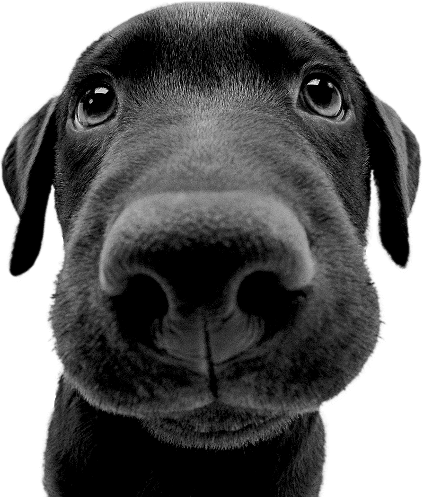

# Image-Drawing

## Tecnologies:

- Python 3.8.9
- PIL and a few dependencies

## Purpose:

Get a image and recreate it using a list of caracters that goes from light to dark

## Why?

I saw someone doing huge paintings using dices and it's values from 1 to 6 to recreate light and dark pixels, and i wanted to make a program to do that.

In order to run the code simply type: `python3 main.py`

If you wish to change the image, simply replace test.png with whatever you like, notice that if the format is not png you will have to change it on the `main.py` file.

## **Image used for test**



## Results:

### Using dices


### Using cards


### Using domino pieces


> You can comment line 16 if you dont want to use the darker caracter " ' ", but this make's a better effect if the resolution (imgWidth, imgHeight) has a greater value

### **Note that the caracters have some unwanted spacing between then and this make's the image hard to see from close distances, the more zoomed out it is better the visualization.**

# Editing

Some tips if you want to tweak the code a little bit

Increasing the `imgWidth` and `imgHeight` values creates a bigger and more understandable image

```
imgWidth = 999
imgHeight = 999
```

If you have a better sequence of caracters simply change one of the lists and comment the others or add the new one you want.

```
#caracterMap = ["⚀", "⚁", "⚂", "⚃", "⚄", "⚅"]
#caracterMap = ["🂱", "🂲", "🂳", "🂴", "🂵", "🂶", "🂷", "🂸", "🂹", "🂺"]
#caracterMap = ["🁣", "🁫", "🁳", "🁻", "🂃", "🂋", "🂓"]

# i.e
caracterMap = ["a", "b", "c", "d", "e"]

```

Try commenting these lines to produce some different effects on the image

```
# This inserts the ' caracter as the darker caracter of the list, commenting this may produce a more illuminated image

caracterMap.insert(0, "'")

# This reverse the caracter list, making the dark caracter the last one, may work better with white background images

caracterMap.reverse()

```
